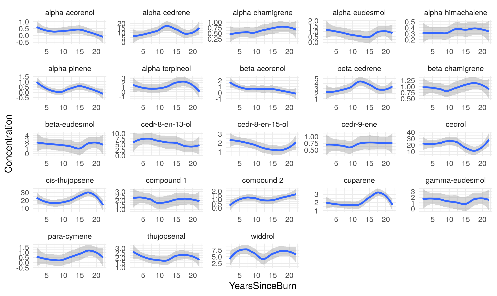

# Create a new directory in YOUR data course repository called Exam_3    
dir.create("Exam_3")

# downloaded specific files into this folder.
# Tasks:
#Library needed:
library(tidyverse)  
library(ggplot2)  
library(dplyr)  
library(readr)  
library(tidyr)  
library(patchwork)  
library(broom)  

I downloaded it and started

## 1  Load and clean FacultySalaries_1995.csv file and Re-create the graph below...
```{r}
library(tidyverse)  
library(ggplot2)  
library(dplyr)  
library(readr)  
library(tidyr)  
library(patchwork)  
library(broom) 
salary_data <- read.csv("FacultySalaries_1995.csv")
# View the structure of the dataset
glimpse(salary_data)
knitr::include_graphics("./Fig1.png")
#pivot_longer() melts the wide salary columns into a long format.
# case_when() helps simplify the Rank labels.
# The result is a tidy data frame where each row is one salary, with columns for Tier, Rank, and Salary.

salary_long <- salary_data %>%
  pivot_longer(
    cols = starts_with("Avg") & ends_with("Salary"),
    names_to = "Rank",
    values_to = "Salary"
  ) %>%
  mutate(
    # Clean Rank column to extract just "Assist", "Assoc", or "Full"
    Rank = case_when(
      str_detect(Rank, "Full") ~ "Full",
      str_detect(Rank, "Assoc") ~ "Assoc",
      str_detect(Rank, "Assist") ~ "Assist"
    ),
    # Reorder Rank and Tier for plotting
    Rank = factor(Rank, levels = c("Assist", "Assoc", "Full")),
    Tier = factor(Tier, levels = c("I", "IIA", "IIB"))
  )

#reorder my variables
salary_long <- salary_long %>%
  filter(!is.na(Tier)) %>%
  mutate(Tier_Rank = factor(Rank, levels = c("Assist", "Assoc", "Full")),
         Tier = factor(Tier, levels = c("I", "IIA", "IIB")))
#plot it
ggplot(salary_long, aes(x = Tier_Rank, y = Salary, fill = Rank)) +
  geom_boxplot() +
  scale_fill_manual(values = c("Assist" = "lightcoral", "Assoc" = "mediumseagreen", "Full" = "cornflowerblue")) +
  labs(x = "Rank", y = "Salary", title = "Faculty Salaries by Rank and Tier (1995)") +
  facet_wrap(~ Tier, scales = "free_x", nrow = 1) +  # Facet by Tier, all in a single row
  theme_minimal() +
  theme(axis.text.x = element_text(angle = 45, hjust = 1),
        strip.text = element_text(size = 12, face = "bold"))
```
While my graph isn't as skinny, I think I was able to get it done.

## 2. Build an ANOVA model and display the summary output in your report

```{r}
# Clean and prepare the dataset
salary_data_clean <- salary_data %>%
  pivot_longer(
    cols = starts_with("Avg") & ends_with("Salary"),
    names_to = "Rank",
    values_to = "Salary"
  ) %>%
  mutate(
    Rank = case_when(
      str_detect(Rank, "Full") ~ "Full",
      str_detect(Rank, "Assoc") ~ "Assoc",
      str_detect(Rank, "Assist") ~ "Assist"
    ),
    Rank = factor(Rank, levels = c("Assist", "Assoc", "Full")),
    Tier = factor(Tier, levels = c("I", "IIA", "IIB")),
    State = factor(State)  # Ensure State is a factor
  )
# Build the ANOVA model
anova_model <- aov(Salary ~ State + Tier + Rank, data = salary_data_clean)
# Display the summary of the ANOVA model
summary(anova_model)

```

Data Preparation:

We use pivot_longer() to reshape the dataset into a long format, making it easier to work with for the ANOVA.

The mutate() function is used to clean up and categorize the Rank and Tier columns. We also ensure that State is treated as a factor.

ANOVA Model:

The formula Salary ~ State + Tier + Rank specifies that we are testing the effect of State, Tier, and Rank on Salary without any interaction terms.

Model Output:

The summary() function will display the ANOVA table, showing the significance of each factor (State, Tier, Rank) in explaining the variation in salary.

Output Interpretation:
In the summary output, you’ll see an F-statistic and p-values for each factor.

## 3. The rest of the test uses another data set. The "Juniper_Oils.csv" data. Get it loaded and take a look. 
## Then tidy it! (show the code used for tidying in your report)

```{r}
#load the data
juniper_data <- read.csv("Juniper_Oils.csv")
glimpse(juniper_data)
head(juniper_data)
colnames(juniper_data)

# Chemical compounds
chemical_compounds <- c("alpha.pinene", "para.cymene", "alpha.terpineol", "cedr.9.ene",
                        "alpha.cedrene", "beta.cedrene", "cis.thujopsene", "alpha.himachalene",
                        "beta.chamigrene", "cuparene", "compound.1", "alpha.chamigrene",
                        "widdrol", "cedrol", "beta.acorenol", "alpha.acorenol", "gamma.eudesmol",
                        "beta.eudesmol", "alpha.eudesmol", "cedr.8.en.13.ol", "cedr.8.en.15.ol",
                        "compound.2", "thujopsenal")

# Tidy the data by pivoting the chemical columns into a long format
juniper_data_tidy <- juniper_data %>%
  pivot_longer(
    cols = all_of(chemical_compounds),
    names_to = "ChemicalCompound",
    values_to = "MassSpecConcentration"
  )
```

Used the listed values and did a quick pivot longer to change the names so they are all considered the same value. 

Then, I reshaped it from wide to long


## 4. Make me a graph of the following:  
        x = YearsSinceBurn
        y = Concentration
        facet = ChemicalID (use free y-axis scales)
        
See the figure below for an idea of what I'm looking for:

```{r}


# Create a named list of y-axis breaks per chemical

y_breaks_list <- list(
  "alpha.acorenol" = c(-0.5, 0.0, 0.5, 1.0),
  "alpha.cedrene" = c(0, 5, 10, 15, 20),
  "alpha.chamigrene" = c(0.25, 0.50, 0.75, 1.00),
  "alpha.eudesmol" = c(0.0, 0.5, 1.0, 1.5, 2.0),
  "alpha.himachalene" = c(0.2, 0.3, 0.4, 0.5),
  "alpha.pinene" = c(-0.5, 0.0, 0.5, 1.0, 1.5),
  "alpha.terpineol" = c(-1, 0, 1, 2, 3),
  "beta.acorenol" = c(-1, 0, 1, 2),
  "beta.cedrene" = c(1, 2, 3, 4, 5),
  "beta.chamigrene" = c(0.50, 0.75, 1.00, 1.25),
  "beta.eudesmol" = c(0, 1, 2, 3, 4),
  "cedr.8.en.13.ol" = c(0.0, 2.5, 5.0, 7.5, 10.0),
  "cedr.8.en.15.ol" = c(1, 2, 3),
  "cedr.9.ene" = c(0.50, 0.75, 1.00),
  "compound.1" = c(0, 0.5, 1.0),
  "compound.2" = c(0, 1, 2),
  "cuparene" = c(0, 1, 2),
  "gamma.eudesmol" = c(0, 1, 2),
  "thujopsenal" = c(0, 1, 2),
  "cis.thujopsene" = c(0, 0.5, 1),
  "widdrol" = c(0, 2.5, 5.0, 7.5),
  "cedrol" = c(0, 2.5, 5.0, 7.5),
  "beta.chamigrene" = c(0, 1, 2)
)


# Custom facet function to apply y-axis breaks
facet_labeller <- function(chemical) {
    function(x) {
      if (x %in% names(chemical)) {
        return(chemical[[x]])
      } else {
        return(pretty(juniper_data_tidy$MassSpecConcentration))
      }
    }
}

# Create the plot
plots <- lapply(unique(juniper_data_tidy$ChemicalCompound), function(compound) {
  ggplot(
    filter(juniper_data_tidy, ChemicalCompound == compound),
    aes(x = YearsSinceBurn, y = MassSpecConcentration)
  ) +
    geom_smooth(method = "loess", se = TRUE, color = "steelblue", fill = "gray80", linewidth = 1) +
    labs(title = compound, x = "Years Since Burn", y = "Concentration") +
    scale_x_continuous(breaks = c(5, 10, 15, 20)) +
    scale_y_continuous(breaks = y_breaks_list[[compound]]) +
    theme_minimal(base_size = 10) +
    theme(
      plot.title = element_text(size = 10, face = "bold"),
      axis.title.y = element_text(size = 8),
      axis.title.x = element_text(size = 8),
      axis.text = element_text(size = 7)
    )
})

ggplot(juniper_data_tidy, aes(x = YearsSinceBurn, y = MassSpecConcentration)) +
  geom_smooth(method = "loess", se = TRUE, color = "steelblue", fill = "gray80", linewidth = 1) +
  facet_wrap(~ ChemicalCompound, scales = "free_y", ncol = 4) +
  labs(
    title = "Chemical Concentrations vs. Years Since Burn",
    x = "Years Since Burn",
    y = "Concentration"
  ) +
  theme_minimal(base_size = 10) +
  theme(
    plot.title = element_text(size = 14, face = "bold"),
    strip.text = element_text(size = 9, face = "bold")
  )

```

I created a y-axis name list with the y-axis values assigned to each.
I then had to assign those breaks to each graph.

I looped it for each unique chemical compound filtering it and plotting a smooth trend.

Then, I plotted it with Facet_wrap for a single large faceted plot.

My text was smaller than the original but I didn't change it.


## 5. Use a generalized linear model to find which chemicals show concentrations that are significantly 
## (significant, as in P < 0.05) affected by "Years Since Burn"

```{r}
# Run a GLM per compound and store only significant terms
glm_results <- lapply(unique(juniper_data_tidy$ChemicalCompound), function(compound) { 
  data_subset <- filter(juniper_data_tidy, ChemicalCompound == compound)
model <- glm(MassSpecConcentration ~ YearsSinceBurn, data = data_subset)
tidy_model <- tidy(model)
tidy_model %>%
  filter(p.value < 0.05) %>%
  mutate(term = if_else(term == "YearsSinceBurn", compound, paste0(compound, ":", term)))
})

significant_terms <- bind_rows(glm_results)
print(significant_terms)

```

Finally, I did a GLM and tidy'd up the results keeping only significant model terms (p<0.05)

I put it into a subset. Then used that subset as a linear regression model and used tidy to clean it up as a neat data frame.

I combined it all and printed the results.


